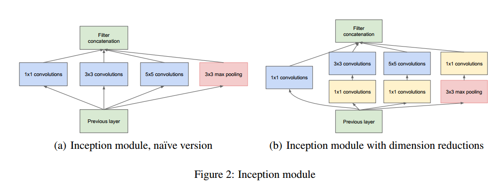

## ResNext阅读笔记
| 文章名称 | 引用 | 链接 |
|--------|--------|----|
|    Aggregated Residual Transformations for Deep Neural Networks  |   Xie S, Girshick R, Dollar P, et al. Aggregated Residual Transformations for Deep Neural Networks[J]. 2016:5987-5995.     |[arXiv](http://xueshu.baidu.com/s?wd=paperuri%3A%2820b0affad7a4ed00e1484e11419ceae7%29&filter=sc_long_sign&tn=SE_xueshusource_2kduw22v&sc_vurl=http%3A%2F%2Farxiv.org%2Fabs%2F1611.05431&ie=utf-8&sc_us=6309461710648735743)|

## 主要思想：
1. 给ResNet网络结构引入Inception网络结构的split-tansform-merge：
-  VGG,ResNet在设计网络结构时的优点是，通过堆叠相同的block，可以很容易地加深网络深度，同时不会引入很多关于网络结构的超参数，例如VGG内部典型的2个conv（3x3）+1个2x2 max pooling, ResNet内部典型的block(3x3 conv - 3x3 conv - 2x2 max pooling)和bottle-block(1x1 conv - 3x3 conv - 1x1 conv - 2x2 max pooling)。但是Inception在设计网络的时候需要更加精心地设计和优化网络的拓扑结构来不断提升性能。
-  然而，Inception系列的网络结构在设计时有一个很独特的策略：split-tansform-merge。如下图：

通过1x1卷积将输入split到几个不同的branch分支，然后各分支执行了不同的变换（3x3, 5x5这里面就引入了一定的多尺度特性），最后再将各分支merge到一起（concate），构成输出。
**这种策略可以在更低的计算复杂度下，获得接近深度,大型网络的表达能力。**

