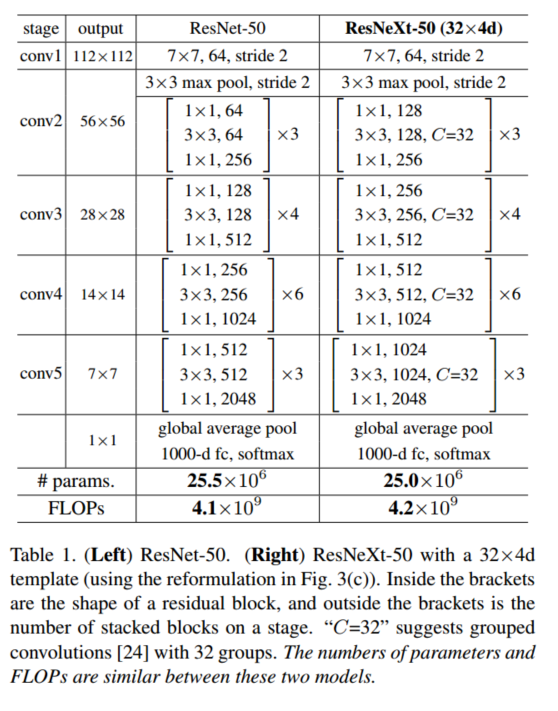

## ResNext阅读笔记
| 文章名称 | 引用 | 链接 |
|--------|--------|----|
|    Aggregated Residual Transformations for Deep Neural Networks  |   Xie S, Girshick R, Dollar P, et al. Aggregated Residual Transformations for Deep Neural Networks[J]. 2016:5987-5995.     |[arXiv](http://xueshu.baidu.com/s?wd=paperuri%3A%2820b0affad7a4ed00e1484e11419ceae7%29&filter=sc_long_sign&tn=SE_xueshusource_2kduw22v&sc_vurl=http%3A%2F%2Farxiv.org%2Fabs%2F1611.05431&ie=utf-8&sc_us=6309461710648735743)|

## 主要思想：
**1. 给ResNet网络结构引入Inception网络结构的split-tansform-merge：**
-  VGG,ResNet在设计网络结构时的优点是，通过堆叠相同的block，可以很容易地加深网络深度，同时不会引入很多关于网络结构的超参数，例如VGG内部典型的2个conv（3x3）+1个2x2 max pooling, ResNet内部典型的block(3x3 conv - 3x3 conv - 2x2 max pooling)和bottle-block(1x1 conv - 3x3 conv - 1x1 conv - 2x2 max pooling)。但是Inception在设计网络的时候需要更加精心地设计和优化网络的拓扑结构来不断提升性能。
-  然而，Inception系列的网络结构在设计时有一个很独特的策略：split-tansform-merge。如下图：
 
 通过1x1卷积将输入split到几个不同的branch分支，然后各分支执行了不同的变换（3x3, 5x5这里面就引入了一定的   多尺度特 性），最后再将各分支merge到一起（concate），构成输出。
 **这种策略可以在更低的计算复杂度下，获得接近深度,大型网络的表达能力。**
- 引用split-tansform-merge这种分支结构，即获得了新的一种网络维度：cardinality[基数，执行不同变换的分支数]，影响网络的性能。文章的实验表明，增加cardinality相对于增加深度和宽度，更容易提升网络的性能，尤其是当增加深度和宽度对现有模型已无效时。

## 结构示例：
- 下面就单个block对比ResNet和ResNeXt，说明为什么ResNeXt使用split-transform-merge结构，提升性能的同时，计算复杂度却不怎么增加的情况下。

左边是ResNet的bottle-neck结构，右边是split-transform-merge设计的ResNeXt Block结构。
左边复杂度(非参数数量)：256x1x1x64+64x3x3x64+64x1x1x256 = **69632**
右边复杂度(非参数数量)：32x(256x1x1x4+4x3x3x4+4x1x1x256) = **70144**
可以看到复杂度并没有提升太多.

- 作者又对上述block操作变换为group convolution,使得实现上更加容易.

依照上述复杂度的计算方法,(a), (b), (c)三种结构的复杂度一致。在(c)中，改为使用group convolution实现，更加方便。

- 以ResNeXt50的结构为例
C = 32是指32个branch，即group convolution的group=32。4d只是指以(c)为模板。

## other points
- block的depth要>=3。等于2时，采用split-transform-merge与原来等价。

解释：如左图，在经过block内的第二层卷积时，虽然是按照group进行卷积，但是接下来马上就会sum到一起，实际上等价于右侧。
