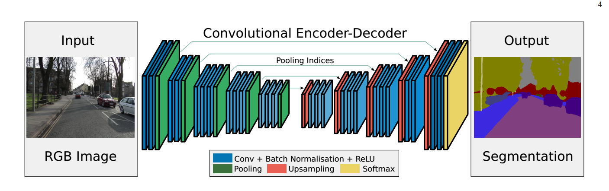
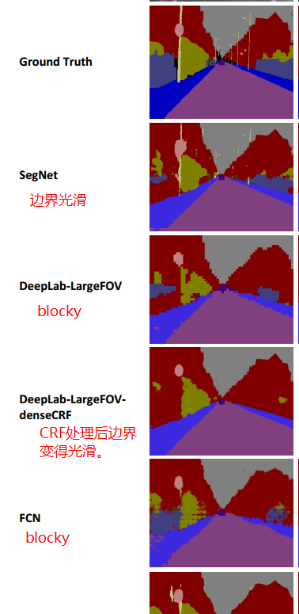
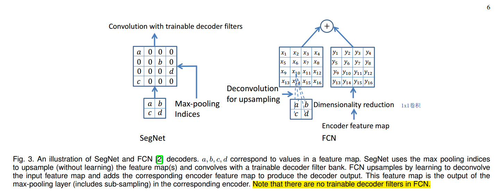

 SegNet阅读笔记
===========

| 文章名称 | 引用 | 链接 |
|--------|--------|----|
|    SegNet: A Deep Convolutional Encoder-Decoder Architecture for Image Segmentation  |   Badrinarayanan V, Kendall A, Cipolla R. SegNet: A Deep Convolutional Encoder-Decoder Architecture for Scene Segmentation.[J]. IEEE Transactions on Pattern Analysis and Machine Intelligence, 2017, PP(99):1-1.     |[arXiv](https://arxiv.org/abs/1511.00561)|
|   SegNet: A Deep Convolutional Encoder-Decoder Architecture for Robust Semantic Pixel-Wise Labelling  |   Badrinarayanan V, Handa A, Cipolla R. SegNet: A Deep Convolutional Encoder-Decoder Architecture for Robust Semantic Pixel-Wise Labelling[J]. Computer Science, 2015.    |[arXiv](https://arxiv.org/pdf/1511.00561)|

[TOC]

## 主要思想

- encoder-decoder结构，可以产生更平滑的分割效果。对比FCN（不加后处理CRF）分割效果，后者的效果呈现块状（blocky），即后者对边界的描述性能不强。原因在于：池化操作造成的分辨率损失，再加上FCN没有进行decoder操作(指的是，相比于SegNet, FCN在skip-connet融合后，没有再进行进一步的卷积)。详细分析见后文。

- unsample的方法。SegNet通过记录池化时的indices，在上采样时，利用记录的indices还原分辨率。好处是：1). 相比于deconvolution，不需要额外的参数进行学习，有利于端到端训练(降低训练难度)。2). 非线性。 3). 提升边界的描述能力。4). 易于扩展到其他的encoder-decoder结构。

- 基于本文的unsample方法，得到的feature map是稀疏的，所以再接入卷积层，产生dense feature map。**decoder的卷积层是不加bias和激活函数的。**

- encoder部分利用了VGG16网络结构(去除fc层)，相比于u-Net，更容易利用pre-train模型。同时，相比于同样的encoder-decoder结构的DeconvNet，后者没有去除VGG的fc层，显然引入了巨大的参数冗余。

## 内容选摘
1. SegNet与一些分割结构的对比：

| A | B | 对比 |
|---|---|---|
| SegNet| FCN| 两者在decoder上的差别：SegNet是unsample(reuse the pool indices)+conv; FCN是先将来自于encoder的feature map 1x1卷积，使维度缩减为1/2，然后另一支进行unsample(反卷积/双线性插值)，然后对应feature map逐元素相加。FCN相比于SegNet，其decoder中，没有可训练的decoder filter(conv)作用于相加的结果。 见下图。|
| SegNet| DeconvNet| DeconvNet与SegNet结构很相似，但是DeconvNet在利用VGG16模型时，保留了fc层，导致参数规模比SegNet大很多，训练的难度也随之增加。 |
| SegNet| U-Net| U-Net也是encoder-decoder结构，常用于医学图像。U-Net的一般实现中，上采样是转置卷积或者双线性插值，而且存在skip-connet。相比于SegNet没有重利用池化indices， decoder是将encoder阶段的feature map与上采样的输出featuer map拼接，再进行卷积，意味着更多的内存代价。|

2. SegNet的一般结构没有skip-connet，相比于FCN的多层融合。而是采用记录池化indices的方式，进行上采样，这样减少了内存占用。实验中SegNet的变体SegNet-Basic-EncoderAddition，也实验了skip-connet的方式，即将每个encoder的64个feature map与对应的decoder输出融合。具体操作是：在decoder(上采样+卷积)后，对应feature map逐元素相加得到输出。
**实验证明，该变种性能最优，但是是在增加更多存储的情况下。**

3. 在文中的实验，SegNet对于瘦细结构目标(路灯等)的分割效果明显优于FCN、DeepLab-LargeFOV。

4. 文中的实验，SegNet Baise结构是4个encoder，4个decoder，卷积都是7x7，feature map数量都是64。不同的decoder变体实验表明：
> 在文中的实验，SegNet并非全部指标最优(除在某些实验中的某一指标)，但是考虑到性能，内存占用，测试阶段的时间等的折中，对比FCN、DeepLab-LargeFOV、DeconvNet及一些变体，SegNet是最好的。
- 实验中SegNet的变体SegNet-Basic-EncoderAddition，将每个encoder的64个feature map与对应的decoder输出融合。此时全部encoder feature map均需存储，边界的描述也最为清晰

- 当推断过程的内存受约束时，一种encoder feature maps压缩的形式：存储池化的indices，减少feature map 维度。能够得到折中的性能。

- 对于给定的encoder网络，decoder维度越大，性能越好（一定范围内）。
- **可学习的上采样(转置卷积)优于双线性插值。**

5. CRF。CRF后处理可以明显光滑分割结果。但是CRF参数获取比较麻烦。而SegNet分割的结果本身就比较光滑。

